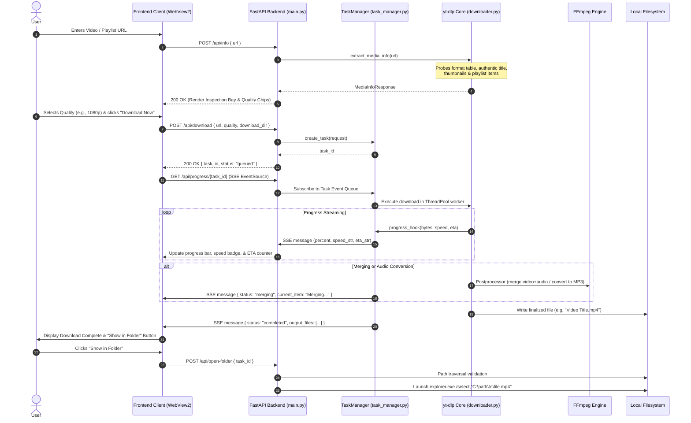

# ⚡ OmniDownloader — Comprehensive Technical Documentation & Architecture Manual

> **Version:** 1.2.4  
> **Target OS:** Windows 10 / 11 (x64)  
> **Architecture:** Local-First Micro-Service / Hybrid Desktop Client  
> **Repository:** [Aniketkumar-01/socials_downloader](https://github.com/Aniketkumar-01/socials_downloader)  
> **License:** MIT  

---

## Table of Contents
1. [Executive Summary & Core Philosophy](#1-executive-summary--core-philosophy)
2. [Technology Stack: What We Use & Why We Use It](#2-technology-stack-what-we-use--why-we-use-it)
3. [End-to-End System Architecture](#3-end-to-end-system-architecture)
4. [Backend Engineering & Module Breakdown](#4-backend-engineering--module-breakdown)
5. [Frontend Architecture & Cyber-Obsidian UI/UX Design System](#5-frontend-architecture--cyber-obsidian-uiux-design-system)
6. [Security Architecture & Threat Hardening](#6-security-architecture--threat-hardening)
7. [REST API & Real-Time SSE Protocol Specification](#7-rest-api--real-time-sse-protocol-specification)
8. [Media Extraction, Remuxing & Platform Bypass Engine](#8-media-extraction-remuxing--platform-bypass-engine)
9. [Build, Packaging & Distribution Pipeline](#9-build-packaging--distribution-pipeline)
10. [Operational Runbook, Edge Cases & Troubleshooting](#10-operational-runbook-edge-cases--troubleshooting)

---

## 1. Executive Summary & Core Philosophy

**OmniDownloader** is a high-performance, local-first Windows desktop media extraction and remuxing suite. It enables users to download high-definition video, audio, and playlists from YouTube, Instagram, TikTok, X (Twitter), Bilibili, and over 1,000 supported platforms with zero loss in fidelity, real-time byte-level telemetry, and zero cloud dependency.

### Core Engineering Principles
1. **100% Privacy & Local-First Execution**: The application runs entirely on the user's workstation (`127.0.0.1`). No media, URLs, telemetry, or user credentials ever touch an intermediary cloud server.
2. **Zero-Bloat Native Windows Experience**: Rather than shipping a 150MB+ Electron runtime with redundant Chromium instances, OmniDownloader leverages the operating system's native **Microsoft Edge WebView2** engine and Win32 APIs, keeping the installer lightweight and memory footprint minimal.
3. **Resilient Multi-Platform Extraction**: Social media platforms constantly evolve bot mitigations, rate limits, and client signatures. OmniDownloader embeds a multi-tier fallback architecture combining active web extractors, automatic local browser session probing, and mobile API client fallbacks.
4. **Defense in Depth**: Robust defenses against Windows-specific vulnerabilities, including path traversal, mount-point crashes (`WinError 448`), DOS device name injection (`CON`, `PRN`, `NUL`), and shell quoting bugs.
5. **Cyber-Obsidian Aesthetic**: A state-of-the-art UI featuring deep obsidian dark tones, glowing neon mint/cyan accents, micro-animations, and high-legibility typography designed for clarity and visual delight.

---

## 2. Technology Stack: What We Use & Why We Use It

Every library, framework, and tool in OmniDownloader was deliberately chosen to balance performance, reliability, native Windows integration, and bundle size.

| Layer | Technology Selected | Alternatives Considered | Technical Rationale & Justification ("Why") |
| :--- | :--- | :--- | :--- |
| **Backend Runtime** | **Python 3.10+ (64-bit)** | Node.js, Go, Rust | Python provides native interoperability with `yt-dlp` (the industry-standard extraction engine), rich `ctypes` bindings to the Win32 API, and rapid development without sacrificing I/O throughput. |
| **Web Server Framework** | **FastAPI + Starlette** | Flask, Django, Express | FastAPI offers asynchronous request handling (`async`/`await`), built-in Pydantic v2 data validation, high throughput with ASGI, and native Server-Sent Events (SSE) streaming capabilities with zero boilerplate. |
| **ASGI Server** | **Uvicorn (h11 protocol)** | Hypercorn, Daphne, Gunicorn | Ultra-fast ASGI web server implementation. Bound strictly to `127.0.0.1` in an isolated daemon thread, ensuring instant startup, minimal memory overhead, and clean shutdown hooks. |
| **Data Validation** | **Pydantic v2** | Marshmallow, manual checks | Compiled Rust core (`pydantic-core`) ensures near-zero deserialization latency, strict type checking, and automatic JSON schema generation for API contracts. |
| **Media Extraction** | **yt-dlp** | youtube-dl, pytube, custom scrapers | Actively maintained by a global developer community, supports 1,000+ sites, handles dynamic JavaScript player deciphering (n-sig / sig tokens), supports DASH/HLS stream separation, and provides hooks for format filtering. |
| **Media Transcoding** | **FFmpeg (via imageio-ffmpeg / system PATH)** | libav, moviepy, handbrake | The universal standard for audio/video codec manipulation. Required to merge separate DASH high-res video (VP9/AV1) and audio (Opus/AAC) into universal MP4 containers, or transcode to 320kbps MP3 with embedded cover art. |
| **Desktop Window GUI** | **PyWebView / Microsoft Edge WebView2 App Mode** | Electron, Tauri, PyQt, Tkinter | Electron bundles ~150MB of Chromium and consumes 300MB+ RAM. PyWebView and Edge App Mode reuse the pre-installed Windows 10/11 Evergreen Edge WebView2 runtime, yielding a tiny binary size, full CSS3/ES6 support, and negligible RAM usage. |
| **Win32 Integration** | **ctypes + PowerShell (STA) + Tkinter** | pywin32, PyQt dialogs | Uses lightweight built-in Windows components for native message boxes, native folder browsers, and Windows Explorer `/select` file reveals without introducing heavy C-extension dependencies. |
| **Frontend Framework** | **Vanilla ES6+ JavaScript** | React, Vue, Svelte, Angular | Zero build step, zero `node_modules` overhead, instant DOM rendering, zero vulnerability maintenance, and native browser APIs (`EventSource`, `fetch`, `FormData`). |
| **Frontend Styling** | **Vanilla CSS3 (Custom Design System)** | Tailwind CSS, Bootstrap | Custom CSS variables (design tokens), hardware-accelerated animations, zero compile step, seamless dark-mode depth, and bespoke glassmorphism. |
| **Typography** | **Google Fonts (`Outfit` & `JetBrains Mono`)** | System fonts, Inter | `Outfit` provides a geometric, futuristic, premium look for headlines and controls; `JetBrains Mono` delivers monospace alignment for file sizes, speeds, and technical error logs. |
| **Binary Compiler** | **PyInstaller** | Nuitka, cx_Freeze | Robust support for dynamic packaging, hidden imports discovery, embedded data bundling, UPX compression, and windowed (no-console) execution. |
| **Windows Installer** | **Inno Setup 6** | WiX Toolset, NSIS, MSIX | Standard enterprise-grade Windows installer compiler. Produces clean, non-admin (per-user) installers that register with Windows Search, Start Menu, Desktop, and Windows Settings "Installed apps" uninstaller. |
| **CI/CD Automation** | **GitHub Actions (`windows-latest`)** | AppVeyor, GitLab CI | Seamless native integration with GitHub Releases, automated builds triggered on version tags (`v*`), running Choco Inno Setup and PyInstaller on clean Windows runners. |

---

## 3. End-to-End System Architecture

OmniDownloader employs a **Local-First Client-Server Architecture** operating entirely inside the user's local operating system boundary.

### High-Level Architectural Diagram

```mermaid
graph TD
    subgraph Desktop Shell ["🖥️ Windows Desktop Shell"]
        Launcher["launcher.py<br/>(Self-Healing Host)"]
        UI["WebView2 / Browser App Window<br/>(Vanilla HTML5 / CSS3 / ES6)"]
    end

    subgraph Backend Engine ["⚡ Localhost Backend (127.0.0.1:8000+)"]
        API["FastAPI / Uvicorn Server<br/>(Endpoints, CORS, Traversal Checks)"]
        TaskManager["TaskManager<br/>(Thread-Safe Queue & State Machine)"]
        SSEHub["SSE Event Stream<br/>(Real-Time Progress Pub/Sub)"]
    end

    subgraph Media Worker Pipeline ["⚙️ Media Execution Pipeline"]
        WorkerPool["ThreadPoolExecutor<br/>(Non-blocking I/O Workers)"]
        YTDLP["yt-dlp Extraction Core<br/>(Platform Detect, Sig Decipher, Probing)"]
        FFMPEG["FFmpeg Binary<br/>(Muxer, Transcoder, Tag Writer)"]
    end

    subgraph Storage & OS ["💾 Windows Operating System"]
        Settings["%LOCALAPPDATA%/OmniDownloader<br/>(settings.json, cookies.txt, logs)"]
        Downloads["Target Destination Folder<br/>(e.g., Desktop/dds or Downloads)"]
        Explorer["Windows Explorer<br/>(File Highlight & Reveal)"]
    end

    Launcher -->|Spawns in Daemon Thread| API
    Launcher -->|Launches Native Window| UI
    UI -->|REST: /api/info, /api/download| API
    UI -->|SSE: /api/progress/{task_id}| SSEHub
    API -->|Queues Tasks| TaskManager
    TaskManager -->|Dispatches Job| WorkerPool
    WorkerPool -->|Executes Download| YTDLP
    YTDLP -->|Streams Hooks| TaskManager
    TaskManager -->|Pushes Real-time State| SSEHub
    YTDLP -->|Remuxes / Merges| FFMPEG
    FFMPEG -->|Writes Media File| Downloads
    API -->|Persists Directory & Config| Settings
    API -->|Triggers Reveal| Explorer
```

### Request & Execution Lifecycle



---

## 4. Backend Engineering & Module Breakdown

### 4.1 `launcher.py` — Self-Healing Host Launcher
`launcher.py` is the bootstrap entry point for both frozen standalone binaries (`OmniDownloader.exe`) and source installations.
- **Port Discovery (`find_available_port`)**: Checks if default port `8000` is bound. If occupied, probes sequential ports up to `8050` to guarantee startup without crashing due to port conflicts.
- **Mount Point Hardening (`_safe_realpath` & `sanitize_system_path`)**: Protects against Windows `WinError 448: ERROR_UNTRUSTED_MOUNT_POINT` caused by broken symlinks or Node Version Manager (`.nodejs`) junctions in system `PATH`.
- **Tri-Level Window Orchestration**:
  1. *Level 1 (PyWebView)*: Attempts native Edge WebView2 creation.
  2. *Level 2 (Native Edge App Shell)*: If PyWebView is absent, locates `msedge.exe` or `chrome.exe` and launches with `--app=http://127.0.0.1:{port}` and an isolated profile, giving a windowed application without browser tabs or address bar.
  3. *Level 3 (Default Browser Fallback)*: Opens system browser and keeps background daemon alive.
- **Native Diagnostic Fallback (`show_native_message`)**: Invokes `MessageBoxW` via Win32 `ctypes` on fatal bootstrap errors so the user is never left with silent failures.

### 4.2 `backend/app/main.py` — REST API & Security Gateway
- **CORS Middleware**: Restricts allowed origins strictly to local loopback hosts (`127.0.0.1`, `localhost`) to prevent unauthorized cross-origin access from external web pages.
- **Path Traversal Shield**: All endpoints accepting or returning paths (`/api/file`, `/api/open-folder`, `/api/choose-folder`) resolve paths strictly with `Path.resolve()` and verify containment against whitelisted directories via `is_relative_to()`.
- **Windows Explorer Launcher (`/api/open-folder`)**: Formats command strings directly (`explorer.exe /select,"<filepath>"`) rather than passing Python argument lists, preventing Python's `list2cmdline` from incorrectly quoting switches and defaulting to `Documents`.
- **Folder Picker Service (`/api/choose-folder`)**:
  - Leverages Tkinter `filedialog.askdirectory` with a withdrawn topmost parent window.
  - Returns `("CANCEL", None)` if the user dismisses the dialog, terminating immediately without triggering secondary or tertiary Windows Forms popups.

### 4.3 `backend/app/task_manager.py` — State Machine & Concurrency Hub
- **Thread Safety**: Protects shared task maps using internal synchronization and thread-safe queue dispatches (`loop.call_soon_threadsafe`).
- **Cooperative Cancellation**: Tracks cancelled task IDs in a thread-safe set. `progress_hook` and `postprocessor_hook` check cancellation flags before every I/O chunk, raising `DownloadCancelled` to terminate `yt-dlp` immediately and clean up partial files.
- **Cookie Jar Isolation**: When a task executes, any persistent `cookies.txt` is cloned to a temporary per-task file (`cookie_task_{task_id}.txt`). This prevents concurrent downloads from corrupting the master cookie file during session writebacks.
- **Subscriber Event Queues**: Each SSE client connection obtains an isolated `asyncio.Queue`. The worker thread updates task progress up to 5 times per second, discarding duplicate states to prevent queue saturation.

### 4.4 `backend/app/downloader.py` — Universal Extraction Engine
- **Platform Detection**: RegEx parser identifying YouTube (Videos, Shorts, Playlists), Instagram, TikTok, X (Twitter), Bilibili, and generic sites.
- **Adaptive Quality Tiering**:
  - Analyzes video format lists and groups available streams into clean resolution tiers: `2160p (4K)`, `1440p (2K)`, `1080p (FHD)`, `720p (HD)`, `480p (SD)`, `360p`, and `audio_mp3`.
  - Calculates approximate file sizes based on bitrate (`tbr`, `vbr`, `abr`) and media duration.
- **Stream Merging & Codec Handling**:
  - Automatically merges optimal video stream (`bestvideo`) with optimal audio stream (`bestaudio`) using FFmpeg.
  - Sets output container to `.mp4` for maximum device compatibility.
  - When `audio_mp3` is selected, extracts audio, transcodes to 320kbps MP3 via `FFmpegExtractAudio`, and embeds thumbnail cover art using `FFmpegThumbnailsConvertor`.
- **Automated Anti-Bot Probing**:
  - If YouTube issues a bot verification challenge (`Sign in to confirm you're not a bot`), automatically probes local browser cookies (`edge`, `chrome`, `firefox`, `brave`) in read-only mode to pass the challenge without manual user configuration.

### 4.5 `backend/app/models.py` — Strict Pydantic Data Contracts
Defines validated input/output models:
- `InfoRequest`: URL string with validation and browser session selector.
- `MediaInfoResponse`: Structured metadata including platform, title, duration, author, format list, and playlist items.
- `DownloadRequest`: Target URL, quality selector, playlist item IDs, and optional custom download directory.
- `DownloadTaskStatus`: Real-time state representation containing progress percentage, speed, ETA, status enum, output file paths, and active download directory.

### 4.6 `backend/app/config.py` — System Environment & Path Sanitization
- Resolves directories dynamically whether running in development or inside a PyInstaller frozen bundle (`sys._MEIPASS`).
- Standardizes user data storage in `%LOCALAPPDATA%\OmniDownloader`.
- **`sanitize_filename()`**: Enforces Windows filesystem compliance by replacing illegal characters (`< > : " / \ | ? *`) with underscores, trimming trailing dots/spaces, escaping DOS reserved names (`CON`, `PRN`, `AUX`, `NUL`, etc.), and enforcing a 150-character limit to avoid path length overflow (`MAX_PATH`).

---

## 5. Frontend Architecture & Cyber-Obsidian UI/UX Design System

The frontend is implemented with zero framework dependencies, running natively in modern Chromium-based WebView2 engines.

### 5.1 Design System Tokens & Aesthetics
```css
:root {
  /* Surface & Background Hierarchy */
  --bg-core: #08090d;           /* Deep obsidian foundation */
  --bg-shell: #0e121a;          /* Card & container elevation */
  --bg-surface: #141923;        /* Input & interactive element fill */
  --bg-surface-hover: #1c2331;  /* High-contrast hover state */

  /* Cyber Glow Accents */
  --accent-primary: #00f0b5;    /* Vibrant neon mint */
  --accent-glow: rgba(0, 240, 181, 0.25);
  --accent-secondary: #00d2ff;  /* Electric cyan */

  /* Status Colors */
  --status-success: #00f0b5;
  --status-error: #ff3366;
  --status-warning: #ffb800;

  /* Typography */
  --font-display: 'Outfit', -apple-system, sans-serif;
  --font-mono: 'JetBrains Mono', monospace;
}
```

### 5.2 Key UI Components
1. **Omni-Search Hero Bar**:
   - High-contrast URL input field with auto-paste detection, clear button, and keyboard shortcut handler (<kbd>Enter</kbd> to submit).
   - Dynamic validation badge indicating recognized platform (YouTube, TikTok, Instagram, etc.).
2. **Media Inspection Bay**:
   - Renders media thumbnail, authentic creator/author, duration badge, and video title with smooth fade-in animations.
   - For playlists: Displays total item count, cumulative playlist runtime, and an expandable item checklist.
3. **Adaptive Quality Selector**:
   - Radio pill buttons dynamically populated based on stream availability (`Best`, `1080p`, `720p`, `480p`, `MP3`).
   - Displays estimated file size badges calculated from stream bitrates.
4. **Active Download Drawer & Progress Dashboard**:
   - Multi-stage state machine: `queued` → `downloading` → `merging` → `completed` (or `cancelled` / `error`).
   - Smooth animated progress bar with glowing cyan head.
   - Real-time download speed (`MB/s`), total size downloaded, and dynamic ETA counter.
   - Action bay offering direct "Show in Folder" exploration and "Download Another" reset.
5. **Settings & Environment Modal**:
   - Allows changing the destination download folder with a single-dialog native folder picker.
   - Displays FFmpeg installation status and 1-click winget installer.

---

## 6. Security Architecture & Threat Hardening

OmniDownloader adheres to strict security standards to ensure safe desktop execution:

```
+-------------------------------------------------------------------------+
|                         THREAT MITIGATION MATRIX                        |
+-----------------------------------+-------------------------------------+
| Threat Vector                     | Mitigation Implemented              |
+-----------------------------------+-------------------------------------+
| Path Traversal (Directory Escape) | Strict Path.resolve() verification  |
|                                   | Whitelist checking via is_relative  |
+-----------------------------------+-------------------------------------+
| Command Injection                 | Subprocess arguments passed as safe |
|                                   | lists; shell=False everywhere       |
+-----------------------------------+-------------------------------------+
| Windows Explorer Quoting Bugs     | Formatted string with explicit      |
|                                   | quotes: explorer.exe /select,"path" |
+-----------------------------------+-------------------------------------+
| DOS Reserved Device Name Denial   | sanitize_filename() prepends '_' to |
|                                   | names like CON, PRN, AUX, NUL       |
+-----------------------------------+-------------------------------------+
| Untrusted Mount Points (WinErr448)| Safe realpath wrapper intercepts    |
|                                   | OSError and purges broken junctions |
+-----------------------------------+-------------------------------------+
| Cross-Site Request Forgery (CSRF) | CORS middleware restricts origins   |
|                                   | to localhost loopback only          |
+-----------------------------------+-------------------------------------+
| Cookie Jar Corruption             | Per-task isolated temporary cookie  |
|                                   | copies during downloads             |
+-----------------------------------+-------------------------------------+
```

---

## 7. REST API & Real-Time SSE Protocol Specification

All API communication is served over `http://127.0.0.1:{PORT}` with JSON payloads and Server-Sent Events.

### 7.1 Media Extraction: `POST /api/info`
- **Request Body**:
  ```json
  {
    "url": "https://www.youtube.com/watch?v=dQw4w9WgXcQ",
    "cookie_browser": "none"
  }
  ```
- **Response Model (`MediaInfoResponse`)**:
  ```json
  {
    "url": "https://www.youtube.com/watch?v=dQw4w9WgXcQ",
    "title": "Rick Astley - Never Gonna Give You Up (Official Music Video)",
    "duration": 213,
    "duration_formatted": "03:33",
    "thumbnail": "https://i.ytimg.com/vi/dQw4w9WgXcQ/maxresdefault.jpg",
    "uploader": "Rick Astley",
    "platform": "youtube",
    "is_playlist": false,
    "available_qualities": ["best", "1080p", "720p", "480p", "360p", "audio_mp3"],
    "quality_sizes_formatted": {
      "best": "~45.2 MB",
      "1080p": "~38.1 MB",
      "audio_mp3": "~5.1 MB"
    },
    "playlist_items": []
  }
  ```

### 7.2 Start Download: `POST /api/download`
- **Request Body**:
  ```json
  {
    "url": "https://www.youtube.com/watch?v=dQw4w9WgXcQ",
    "quality": "1080p",
    "is_playlist": false,
    "selected_video_ids": null,
    "download_dir": "C:\\Users\\User\\Desktop\\dds"
  }
  ```
- **Response**:
  ```json
  {
    "task_id": "a1b2c3d4",
    "status": "queued",
    "message": "Download task queued successfully."
  }
  ```

### 7.3 Real-Time Progress Stream: `GET /api/progress/{task_id}`
- **Protocol**: `text/event-stream` (Server-Sent Events)
- **Sample Event Stream**:
  ```
  event: message
  data: {"task_id":"a1b2c3d4","status":"downloading","progress":42.5,"speed_str":"8.5 MB/s","eta_str":"00:12","current_item":"Downloading video streams...","completed_items":0,"total_items":1,"output_files":[],"download_dir":"C:\\Users\\User\\Desktop\\dds"}

  event: message
  data: {"task_id":"a1b2c3d4","status":"merging","progress":99.0,"speed_str":"Processing","eta_str":"00:01","current_item":"Merging audio and video streams (ffmpeg)...","completed_items":0,"total_items":1,"output_files":[],"download_dir":"C:\\Users\\User\\Desktop\\dds"}

  event: message
  data: {"task_id":"a1b2c3d4","status":"completed","progress":100.0,"speed_str":"Complete","eta_str":"00:00","current_item":"Download completed successfully!","completed_items":1,"total_items":1,"output_files":["C:\\Users\\User\\Desktop\\dds\\Rick Astley - Never Gonna Give You Up.mp4"],"download_dir":"C:\\Users\\User\\Desktop\\dds"}
  ```

### 7.4 Cancel Download: `POST /api/cancel/{task_id}`
- Cancels active worker threads, halts ffmpeg processes, removes temporary `.part` files, and emits status `"cancelled"`.

### 7.5 Native Folder Dialog: `POST /api/choose-folder`
- Spawns a single native Windows folder picker modal. Returns:
  ```json
  {
    "status": "success",
    "download_dir": "C:\\Users\\User\\Desktop\\dds",
    "path": "C:\\Users\\User\\Desktop\\dds"
  }
  ```
- If closed or cancelled, returns immediately:
  ```json
  {
    "status": "cancelled",
    "download_dir": "C:\\Users\\User\\Downloads",
    "path": "C:\\Users\\User\\Downloads"
  }
  ```

### 7.6 Windows Explorer Reveal: `POST /api/open-folder`
- **Query Parameter**: `task_id` (optional)
- Uses `explorer.exe /select,"<filepath>"` to open Windows Explorer with the specific downloaded file highlighted and selected.

---

## 8. Media Extraction, Remuxing & Platform Bypass Engine

```
                      +-----------------------------+
                      |   Target URL Submitted      |
                      +--------------+--------------+
                                     |
                                     v
                      +-----------------------------+
                      |   Platform Identification   |
                      |  (RegEx URL Domain Parser)  |
                      +--------------+--------------+
                                     |
                +--------------------+--------------------+
                |                    |                    |
                v                    v                    v
          [ YouTube ]          [ Instagram ]        [ TikTok / X ]
                |                    |                    |
                v                    v                    v
      +-------------------+  +-------------------+  +-------------------+
      | Web Client Probe  |  | Graph API / Web   |  | Clean HD Stream   |
      +---------+---------+  +-------------------+  | (No Watermarks)   |
                |                                   +-------------------+
        [Bot Challenge?]
          /           \
       [Yes]          [No]
        /               \
       v                 v
+---------------+  +---------------+
| Auto-Probe    |  | Extract Stream|
| Local Browser |  | Format Matrix |
| (Edge/Chrome) |  +-------+-------+
+-------+-------+          |
        |                  |
        +--------+---------+
                 |
                 v
+---------------------------------------------------+
|               Download Execution                  |
| 1. DASH Video Stream (AVC / VP9 / AV1)            |
| 2. DASH Audio Stream (AAC / Opus)                 |
+------------------------+--------------------------+
                         |
                         v
+---------------------------------------------------+
|           FFmpeg Post-Processing Muxer            |
| - Merges streams into universal MP4 container     |
| - Or transcodes to 320kbps MP3 + embeds cover art |
+------------------------+--------------------------+
                         |
                         v
+---------------------------------------------------+
|     Final Sanitized Media Written to Disk         |
+---------------------------------------------------+
```

### Format Selection Matrix
- **`best`**: Downloads the absolute highest resolution available (up to 4K/8K 60fps) and merges with highest bitrate audio.
- **`1080p`**: `bestvideo[height<=1080]+bestaudio/best[height<=1080]`
- **`720p`**: `bestvideo[height<=720]+bestaudio/best[height<=720]`
- **`480p`**: `bestvideo[height<=480]+bestaudio/best[height<=480]`
- **`audio_mp3`**: Extracts best audio stream, transcodes to constant 320kbps MP3 via FFmpeg, writes ID3 tags, and embeds full-resolution thumbnail art.

---

## 9. Build, Packaging & Distribution Pipeline

OmniDownloader employs a fully automated dual-binary release pipeline generating both an enterprise-grade installer and a portable executable.

### 9.1 PyInstaller Spec Configuration (`omnidownloader.spec`)
- **Bundle Composition**: Packages Python 3.11 runtime, `uvicorn`, `fastapi`, `starlette`, `sse_starlette`, `yt-dlp`, `platformdirs`, `pillow`, `frontend/` assets, and `backend/app/` logic.
- **`console=False`**: Compiles in windowed mode. Suppresses black command prompt windows from ever appearing.
- **`upx=True`**: Applies UPX executable compression to minimize binary footprint.

### 9.2 Inno Setup Configuration (`installer.iss`)
- **Per-User Non-Admin Install (`PrivilegesRequired=lowest`)**:
  - Installs cleanly into `%LOCALAPPDATA%\Programs\OmniDownloader`.
  - Zero Windows UAC / Administrator permission prompts required.
- **Windows Integration**:
  - Places shortcut in `{autoprograms}` (Start Menu), indexed immediately by **Windows Search** (<kbd>Win</kbd> + type `"Omni"`).
  - Optional Desktop shortcut.
  - Registers full uninstaller in **Windows Settings > Installed apps**.

### 9.3 Automated GitHub Actions CI/CD (`.github/workflows/release.yml`)
- Triggered automatically on git tags matching `v*` (e.g. `v1.2.3`).
- Provisions a `windows-latest` virtual environment.
- Compiles `OmniDownloader.exe` via PyInstaller.
- Compiles `OmniDownloader-Setup.exe` via Inno Setup 6.
- Publishes automated release with release notes and downloadable binary assets.

---

## 10. Operational Runbook, Edge Cases & Troubleshooting

### 10.1 Port Already in Use (Port Collisions)
- **Symptom**: Port 8000 is occupied by another local service (e.g., Docker, dev server).
- **Behavior**: `launcher.py` automatically detects collision via `socket.connect_ex` and rebinds to the next available port (`8001`, `8002`, etc.). Zero user intervention required.

### 10.2 Windows SmartScreen Warning on Newly Compiled Releases
- **Symptom**: Windows displays *"Windows protected your PC"* when opening a newly downloaded `.exe`.
- **Cause**: Standard behavior for open-source binaries that have not yet accrued global hash reputation or an expensive commercial EV Code Signing certificate.
- **Resolution**: Click **"More info"** → **"Run anyway"**.

### 10.3 YouTube "Sign in to Confirm You're Not a Bot"
- **Symptom**: YouTube throttles anonymous scraping IP addresses.
- **Behavior**: OmniDownloader automatically queries local browser profiles (Microsoft Edge or Google Chrome) in read-only mode to pass the verification challenge.

### 10.4 Government or Regional Platform Bans (e.g. TikTok)
- **Symptom**: `Connection to www.tiktok.com timed out` in regions where the platform is ISP-blocked.
- **Resolution**: Connect to a VPN (e.g., Cloudflare 1.1.1.1 WARP, ProtonVPN) before fetching details.

### 10.5 High-Resolution Merging Requires FFmpeg
- **Symptom**: Downloads above 720p or MP3 conversion require FFmpeg.
- **Resolution**: If FFmpeg is missing, OmniDownloader displays a non-intrusive banner with a 1-click installer button, or the user can run:
  ```powershell
  winget install Gyan.FFmpeg
  ```

---

*Authored for the OmniDownloader Project.*  
*Maintained by Aniket Kumar & DeepMind Agentic Engineering.*
